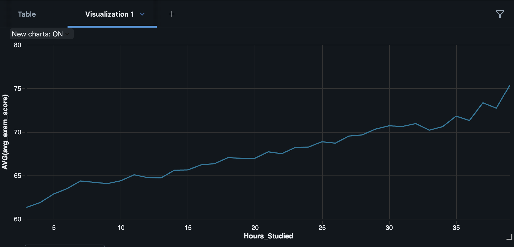

# ETL Pipeline - Student Performance

## Project Overview
This project demonstrates an end-to-end ETL pipeline built in Databricks using PySpark.

The goal is to analyze the relationship between study hours and exam performance.

## Data Sources
This project uses a publicly available dataset:

- Student Performance Dataset (Kaggle): https://www.kaggle.com/datasets/ayeshaseherr/student-performance

The dataset contains information about:
- Hours studied
- Exam scores

Note:
- The dataset is not included in this repository due to licensing restrictions.
- A sample dataset can be added for demonstration purposes if needed.

## Architecture
The pipeline follows a medallion architecture:
- **Bronze**: Raw data ingestion  
- **Silver**: Data cleaning and transformation  
- **Gold**: Aggregated data for analysis  

## Pipeline Steps
1. **Extract**: Load CSV data into a raw table  
2. **Transform**: Clean and prepare data (handle nulls, cast types)  
3. **Load**: Create an aggregated dataset for analysis  

## Analysis
The final dataset is used to analyze the relationship between:
- Hours studied  
- Exam score  

## Visualization

## Tech Stack
- Databricks  
- PySpark  
- SQL  

## Key Insight
The analysis shows a clear positive relationship between study time and exam performance.

## Tech Stack
- Databricks
- PySpark
- SQL

## Key Insight
The analysis shows a clear positive relationship between study time and exam performance.
